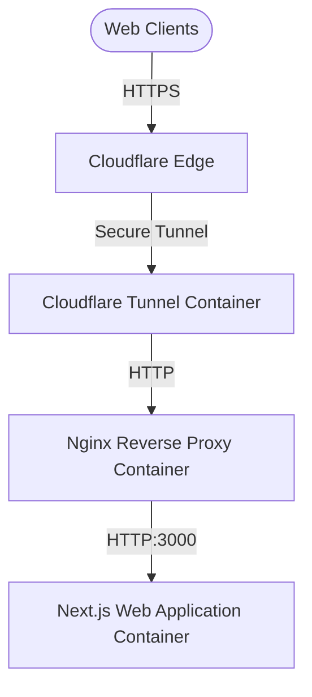

# Instascope Web Application

A modern, highly performant web application for **Instascope** (`https://instascope.com.tr`). This repository contains the complete codebase and deployment configuration for running the application securely using Docker, Nginx, and Cloudflare Tunnels.

---

## 🚀 Architecture Overview

The system is deployed using a multi-container Docker setup orchestrated via `docker-compose.yml`:



1. **Next.js Web Application (`app/`)**: Built with Next.js 15, React 19, Tailwind CSS, and integrated with Firebase.
2. **Nginx Reverse Proxy (`nginx/`)**: Serves as a gateway, optimizing cache delivery for Next.js static assets and enforcing security headers (CSP, HSTS, X-Frame-Options).
3. **Cloudflare Tunnel (`cloudflared/`)**: Establishes a secure outbound tunnel to Cloudflare, eliminating the need to expose open ports (like 80 or 443) to the public internet.

---

## 🛠️ Tech Stack

- **Framework**: [Next.js 15 (App Router)](https://nextjs.org/)
- **UI & Styling**: [React 19](https://react.dev/), [Tailwind CSS](https://tailwindcss.com/), [Lucide React](https://lucide.dev/)
- **Database / Backend**: [Firebase](https://firebase.google.com/)
- **Proxy**: [Nginx (Alpine-based)](https://nginx.org/)
- **Inbound Routing**: [Cloudflare Tunnel](https://www.cloudflare.com/products/tunnel/)
- **Orchestration**: Docker & Docker Compose

---

## ⚙️ Directory Structure

```text
instascope/
├── app/                  # Next.js web application source code
│   ├── .next/            # Next.js build cache (ignored in Git)
│   ├── node_modules/     # Node.js dependencies (ignored in Git)
│   ├── public/           # Static assets (images, icons, etc.)
│   ├── src/              # Next.js app pages, components, & logic
│   ├── Dockerfile        # Multi-stage production build configuration
│   ├── package.json      # App dependencies & scripts
│   └── .env.example      # Example environment variables template
├── nginx/
│   └── nginx.conf        # Nginx configuration (routing & headers)
├── cloudflared/          # Cloudflare configuration folder
├── docker-compose.yml    # Docker services orchestration
├── .env.example          # Root environment variables template
└── README.md             # Project documentation
```

---

## 🔑 Environment Variables

To run the application, you need to configure two environment configurations:

### 1. Root Environment Variables (`.env`)
Create a `.env` file in the project root folder. Refer to [.env.example](.env.example):
```env
# Mode setting
NODE_ENV=production

# App Domain URL
NEXT_PUBLIC_APP_URL=https://instascope.com.tr

# Cloudflare Tunnel Authentication Token
CLOUDFLARE_TUNNEL_TOKEN=your_cloudflare_tunnel_token_here
```

### 2. Next.js App Environment Variables (`app/.env.local`)
Create a `.env.local` file inside the `app/` directory. Refer to [app/.env.example](app/.env.example):
```env
# Firebase Configuration
NEXT_PUBLIC_FIREBASE_API_KEY=your_firebase_api_key_here
NEXT_PUBLIC_FIREBASE_AUTH_DOMAIN=your_firebase_auth_domain_here
NEXT_PUBLIC_FIREBASE_PROJECT_ID=your_firebase_project_id_here
NEXT_PUBLIC_FIREBASE_STORAGE_BUCKET=your_firebase_storage_bucket_here
NEXT_PUBLIC_FIREBASE_MESSAGING_SENDER_ID=your_firebase_messaging_sender_id_here
NEXT_PUBLIC_FIREBASE_APP_ID=your_firebase_app_id_here

# Ads visibility switch
NEXT_PUBLIC_SHOW_ADS=false

# Google Analytics 4 Measurement ID
NEXT_PUBLIC_GA_ID=your_ga_measurement_id_here
```

---

## 🚀 Setup & Execution

### Prerequisites
- Docker (v20.10+)
- Docker Compose (v2.0+)

### Step 1: Clone & Configure
1. Clone this repository to your target server/environment.
2. Setup the environment files described in the **Environment Variables** section.

### Step 2: Launch the Containers
To build and start all containers in detached mode:
```bash
docker compose up -d --build
```

### Step 3: Monitor & Verify
Verify that the services are up and healthy:
```bash
docker compose ps
```

You can view container logs for troubleshooting:
```bash
docker compose logs -f
```

---

## 🛡️ Security Best Practices

- **Never commit your `.env` or `.env.local` files to Git**. They contain sensitive credentials (Firebase keys, Cloudflare tokens) and are ignored by default via `.gitignore`.
- Ports `80` and `443` do not need to be mapped to the host machine, as `cloudflared` proxies traffic safely. Only port `3000` is exposed locally for test access if needed.
